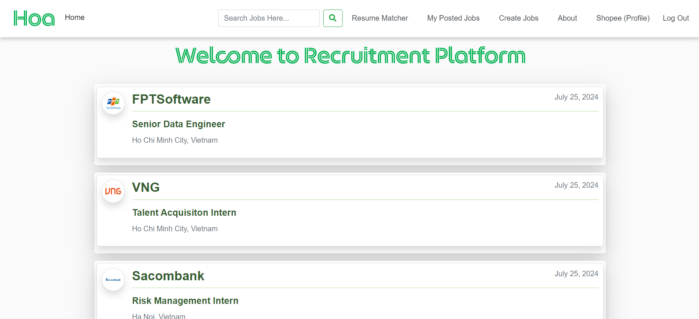

# Nền tảng tuyển dụng 
- Mục đích sử dụng: Ứng dụng web được tạo nhằm mục đích xem độ phù hợp của hồ sơ ứng viên (Resume) và mô tả công việc của nhà tuyển dụng (Job Description) từ đó có thể cải thiện hồ sơ của ứng viên. 

- Ngoài chức năng Resume Matcher (xem độ phù hợp của Resume) thì ứng dụng web này còn mô phỏng đầy đủ các chức năng của một nền tảng tuyển dụng khi có sự tương tác của ứng viên và nhà tuyển dụng.
## Ứng dụng cuối: [https://django-recruitment.onrender.com/](https://django-recruitment.onrender.com/) 


---

## Tổ chức dự án
```

├── core                              : Thiết lập cấu hình 
├── blog                              : Tạo các trang: Home, Create Jobs, My Posted Jobs, Resume Matcher, About, Search
├── users                             : Tạo người dùng: Login, Logout, Profile, Signup
├── media/                            : Lưu trữ các ảnh tải lên
├── manage.py                            
├── .gitignore                        
├── README.md                         : Tổng quan ứng dụng web
└── requirements.txt                  : Các thư viện yêu cầu 
```

---
## Triển khai ứng dụng Django lên Render
- Tạo DATABASE PostgreSQL trên Render
- Tạo ứng dụng bằng Web Service trên Render: kết nối với Github và link DATABSE PostgreSQL.


## Cốt lõi:
- **Xử lí ngôn ngữ tự nhiên**: Sử dụng API_KEY của Google GenerativeAI và Langchain tạo promt để trích xuất được kết quả là độ phù hợp giữa Resume và Job Description (chức năng Resume Matcher)
- **Front-end**: Sử dụng Bootstrap để tạo thành phần giao diện người dùng như lưới (grid), biểu mẫu, nút, thanh điều hướng, giúp tạo ra giao diện người dùng đẹp mắt và đáp ứng; JavaScript để tạo các tương tác động, xử lý sự kiện trên trình duyệt, xác thực biểu mẫu phía client, gửi và nhận dữ liệu bằng AJAX mà không cần tải lại trang; django-crispy-forms để tạo các biểu mẫu đẹp mắt và dễ quản lý trong ứng dụng Django.
- **Back-end**: Sử dụng Django để tạo dự án, Pillow để xử lí hình ảnh tải lên; PyPDF2 để xử lí các Resume hoặc CV được tải lên; Sau đó tích hợp mô hình AI của Google GenerativeAI để xử lí ngôn ngữ tự nhiên từ dữ liệu được trích xuất Resume, cuối cùng đưa ra kết quả phân tích
- **Triển khai trên Render**: Tạo Database và kết nối Github để tạo ứng dụng.

## Ứng dụng hoạt động như thế nào?

#### Khi người dùng chưa xác thực (đăng kí và đăng nhập) thì có thể xem các công việc được đăng tải nhưng không thể thực hiện các chức năng "Apply Job" và "Resume Matcher"

#### Khi người dùng đã xác thực (đã đăng nhập) thì có thể thực hiện 2 vai trò tùy mục đích sử dụng:
- Nhà tuyển dụng: Tạo các bài đăng tuyển dụng, chỉnh sửa bài đăng, xem hồ sơ đã ứng tuyển, xem danh sách các bài đã đăng tuyển,...
- Ứng viên: Xem thông tin các bài đăng và ứng tuyển, đặc biệt có thể Resume Matcher ngay trên bài đăng từ Job Description,... 

Refer to the following diagram to understand how the different chains and components are constructed:


## Công cụ sử dụng:
- Google GenerativeAI
- LangChain
- PyPDF2
- Boostrap
- Render
- django-crispy-forms
---
## Hình ảnh các trang trong ứng dụng Django:


---
Truy cập ứng dụng [https://django-recruitment.onrender.com/](https://django-recruitment.onrender.com/) và Resume Matcher.
